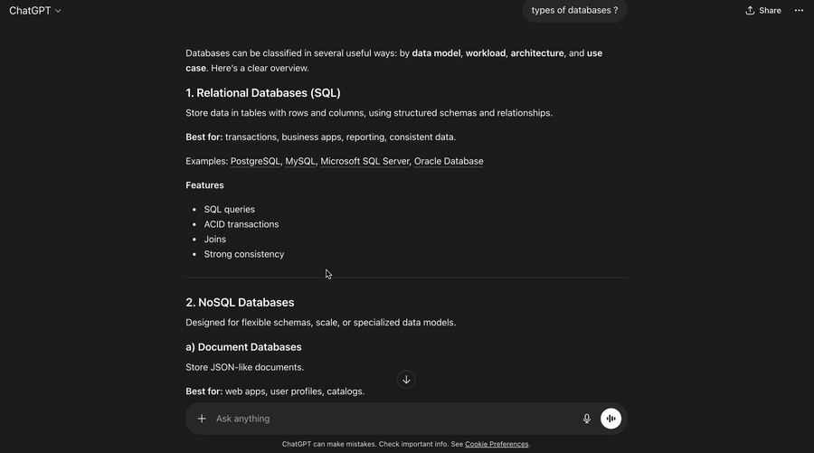

# Ask ChatGPT Multi

> Stack multiple quoted follow-ups into one ChatGPT message — without ever leaving the composer.

A tiny Chrome extension that upgrades ChatGPT's built-in **"Ask ChatGPT"** popup. Instead of letting it replace the composer's single quote reference, this extension **appends each quoted selection** into the composer as a markdown blockquote, dropping the cursor on a fresh blank line so you can type your comment. Quote again → stacks below. Quote again → stacks below. Send when you're ready.

No widget. No side panel. No API key. Works with your existing ChatGPT login.



---

## Why

ChatGPT's native "Ask ChatGPT" only quotes **one** passage at a time. If a long reply has five bullet points and you want to ask about four of them, you either:

- send four separate follow-ups (loses shared context), or
- paste quotes by hand (tedious and error-prone)

With this extension you just select → Ask ChatGPT → select → Ask ChatGPT → … → type your combined message → send.

---

## Install

### 👉 [Install from the Chrome Web Store](https://chromewebstore.google.com/detail/gfimipjodfpoeocpboomepjgmocigfjb)

One click, auto-updates, works in Chrome / Edge / Brave / Arc / any Chromium browser.

### Alternative: unpacked zip

<details>
<summary>If you'd rather not use the store listing</summary>

1. Download `ask-chatgpt-multi-vX.Y.Z.zip` from [**Releases**](https://github.com/pranay0064/chatgpt-ask-multi/releases)
2. Unzip it somewhere you'll keep around
3. Chrome → `chrome://extensions` → enable **Developer mode** → **Load unpacked** → pick the unzipped folder

</details>

### Build from source

<details>
<summary>For contributors / auditors</summary>

```bash
git clone https://github.com/pranay0064/chatgpt-ask-multi.git
cd chatgpt-ask-multi
npm install
npm run build
```

Then in Chrome: `chrome://extensions` → Developer mode → **Load unpacked** → pick `dist/`.

</details>

---

## Usage

### The basic flow

1. In any ChatGPT reply, **select a passage** with your mouse
2. Click the native **💬 Ask ChatGPT** bubble that appears
3. The composer now contains:
   ```
   > your selected passage

   ▮
   ```
   (cursor on the blank line, ready to type)
4. Type your comment/question for that passage
5. Select another passage → Ask ChatGPT → it stacks below
6. Keep going as long as you want
7. Hit the normal ChatGPT **Send** button (↑ arrow)

### Example

Starting from a ChatGPT reply like:
```
• MergeTree stores files as marks, columns, checksums
• Bloom filters work by hashing into bitmaps
• Query planner chooses between full scans and index scans
```

After three quote-and-comment cycles, your composer looks like:
```
> MergeTree stores files as marks, columns, checksums

how are marks computed?

> Bloom filters work by hashing into bitmaps

which hash function does ClickHouse use?

> Query planner chooses between full scans and index scans

when does it prefer full scans?
```

Send that, ChatGPT addresses all three in one reply.

### Fallback button

If the native "Ask ChatGPT" popup doesn't appear (e.g. you selected text outside a message bubble), a small green **📎 Quote** button floats next to your selection. Clicking it does the same thing.

---

## Privacy

- **No API key.** The extension uses your existing chatgpt.com browser session, same as clicking around the site manually.
- **No data leaves your browser.** Your selections and messages go only to chatgpt.com — exactly where they'd go if you typed them by hand. The extension has no servers, no telemetry, no analytics.
- **No tracking.** No background requests, no bundled SDKs. Read [src/content.ts](src/content.ts) — it's under 150 lines.
- **Host permissions** are limited to `chatgpt.com` and `chat.openai.com`. The extension does nothing on any other site.

---

## Troubleshooting

**Nothing happens when I click Ask ChatGPT.**
Check Chrome DevTools → Console. Every intercept logs `[MultiAsk] intercepted Ask ChatGPT → …`. If you don't see that line, the content script isn't running on this tab — try reloading the extension and refreshing chatgpt.com.

**Extra blank lines are creeping in.**
Already fixed in the latest main — pull and rebuild. If it still happens with a specific sequence, open an issue with the exact steps.

**The selectors stopped working after a chatgpt.com update.**
The extension is small and there's one place to fix it: the `findComposer`, `isNativeAskButton`, and `findSendButton` helpers at the top of [src/content.ts](src/content.ts). PRs welcome.

**I want to quote from outside chatgpt.com (e.g. a docs page).**
Not supported. The extension only runs on chatgpt.com itself.

---

## How it works (for contributors)

- Content script runs only on `chatgpt.com` / `chat.openai.com` (see `manifest.json`)
- Capture-phase click listener catches any button whose label matches `/Ask ChatGPT$/i` and calls `e.stopImmediatePropagation()` so ChatGPT's own handler never runs
- `appendQuoteToComposer` reads the composer's current `innerText`, normalizes whitespace, appends `\n\n> <quote>\n\n`, and writes it back via `execCommand('insertText')` — the one reliable way to drive ChatGPT's ProseMirror composer from outside React
- `normalizeBlankLines` collapses any run of 3+ newlines to 2, so round-tripping through the composer can't accumulate extra gaps

Everything worth reading is in one file: [src/content.ts](src/content.ts).

---

## Development

```bash
npm install
npm run dev     # rebuild on every save
npm run build   # one-shot production build into dist/
```

After a rebuild, hit the reload arrow on `chrome://extensions` and refresh your chatgpt.com tab.

---

## Roadmap / ideas

Open to PRs on any of these:

- [ ] Keyboard shortcut (e.g. ⌘⇧Q) to append the current selection without clicking the popup
- [ ] Support selections from arbitrary web pages, with their source URL included in the quote
- [ ] Edit/remove individual quote blocks from inside the composer
- [ ] Firefox port (MV3 differences to sort out)

---

## Contributing

Issues and PRs welcome. Keep changes scoped — this extension should stay small and auditable. If you're adding a feature, please also note in the PR whether it could trip Chrome Web Store policies.

---

## Disclaimer

Not affiliated with, endorsed by, or sponsored by OpenAI. "ChatGPT" is a trademark of OpenAI. This extension automates clicks and text entry on `chatgpt.com` inside your own browser session — no different, technically, from typing faster. You are responsible for making sure your usage complies with OpenAI's Terms of Service.

---

## License

[MIT](LICENSE) — do what you want, no warranty.
